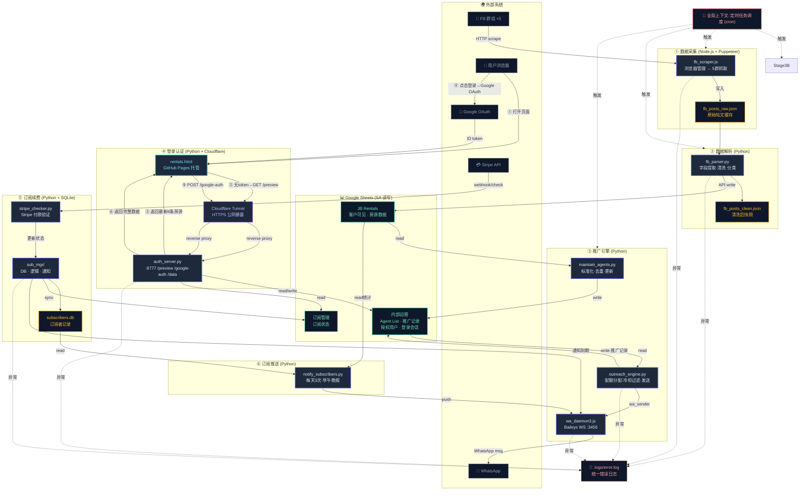

# 🗺️ 系统架构图 — Smart Tenancy Pro (JB Rental Intel)

> 本文件由 **人类主导**（AI_ARCHITECT_PROTOCOL §2），模块关系变更时同步更新。

---

## 全景数据流



---

## 模块边界说明

| 层 | 技术栈 | 状态管理 | 典型文件 |
|:---|:-------|:---------|:---------|
| **数据采集** | Node.js 20 + Puppeteer | 文件系统（JSON） | `scraper/fb_scraper.js`, `scraper/lib/` |
| **数据解析** | Python 3.11 + Google API | Google Sheets（SA读写） | `processors/fb_parser.py`, `processors/lib/` |
| **推广引擎** | Python + Baileys WS | 内部运营 Sheet + SQLite | `outreach/outreach_engine.py`, `outreach/lib/` |
| **登录层** | Python http.server + GSI | 内存 session + Sheets | `auth/auth_server.py`, `rentals.html` |
| **订阅管理** | Python + SQLite + Stripe | SQLite + 订阅状态 Sheet | `sub_mgr/`, `stripe_checker.py` |
| **推送通知** | Python + wa_daemon | SQLite + Sheets | `notify_subscribers.py` |

## 数据流向

```
FB群帖 → 爬虫 → JSON → 解析 → Google Sheets(客户可见)
                                    ↓
                              推广引擎 → WhatsApp → Agent
                                    ↓
                            预览模式(8条) → Google登录 → 全文 → Stripe → 续费
                                    ↓
                              每天3次推送 → 订阅用户
```

## 关键约束

- **调用深度 ≤ 4 层**：任何模块链不超过 4 级嵌套
- **禁止循环依赖**：Parser 不调 Outreach，Auth 不调 Scraper
- **双日志制度**：所有 catch 块输出 `.logs/error.log` + console
- **Sheets 是唯一数据中台**：各模块间不直接读写彼此的本地存储
- **SA 统一认证**：所有 Python 模块共用 `/home/user/.hermes/google_sa_rental.json`
