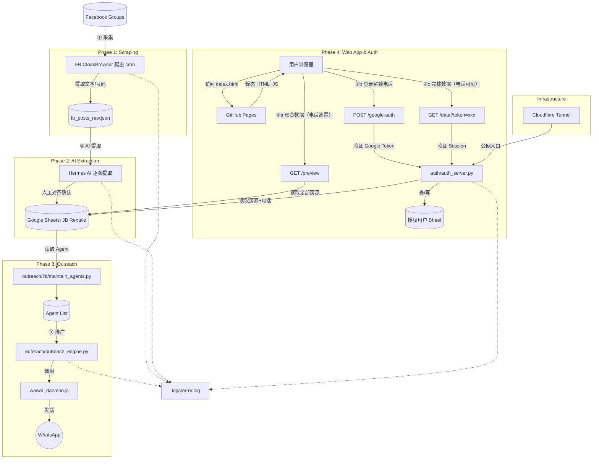
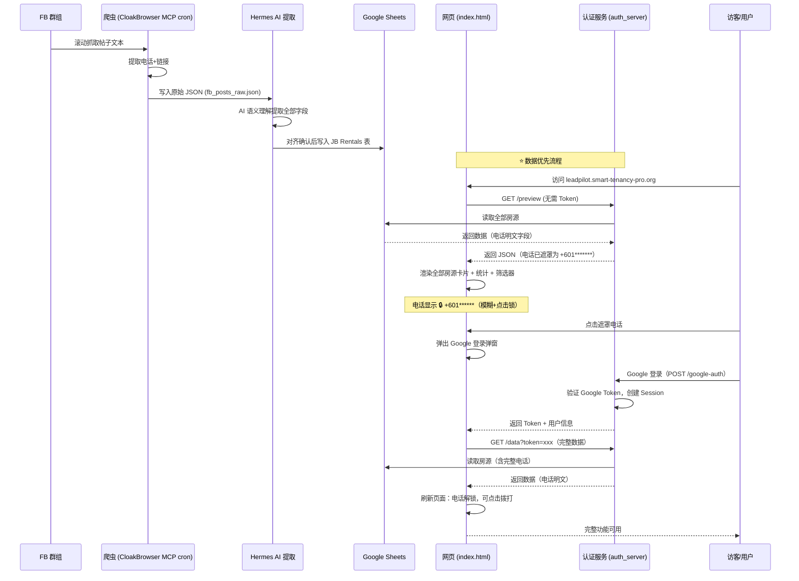

# ARCHITECTURE.md — LeadPilot 全景架构

## 🗺️ 系统拓扑图

## 🌊 核心数据流

## 🧩 模块依赖与状态边界

- **Global Context (全局状态):** 
    - `Google Sheets`（JB Rentals）: 房源数据的 SSOT。
    - `授权用户 Sheet`: 用户订阅状态。
    - `.env`: 敏感凭据 (Stripe/Google Key)。
    - `AUTH_URL`: `auth.smart-tenancy-pro.org`（CNAME → hermes-webui tunnel，稳定不变）。
- **Local State (局部状态):**
    - `wa_session/`: WhatsApp 认证会话。
    - `fb_posts_raw.json`: 采集阶段的中间缓存（**唯一数据源**）。
    - `sessions`（内存）: auth_server 的登录会话（重启丢失）。

## 🎯 认证与数据访问规则

| 状态 | 可见数据 | 电话 |
|------|---------|------|
| 未登录（预览） | 全部房源 + 统计 + 筛选 | 🚫 遮罩 `+601*******` |
| 已登录 | 全部房源 + 统计 + 筛选 | ✅ 可见，可点击拨打 |

- **登录触发时机**：仅当用户点击遮罩的电话号码时，才弹出 Google 登录
- **不弹登录页**：打开网站直接看到房源数据，没有 login gate
- **预览失败回退**：若 Cloudflare Tunnel 断开导致预览数据获取失败，显示登录页作为兜底

## 🚨 日志与异常边界

- 所有的核心服务 (Auth, Scraper, AI, outreach) 必须捕获异常并写入 `.logs/error.log`。
- 调用深度严禁超过 4 层（例如：Engine -> Sender -> Notify -> Daemon ✅）。
